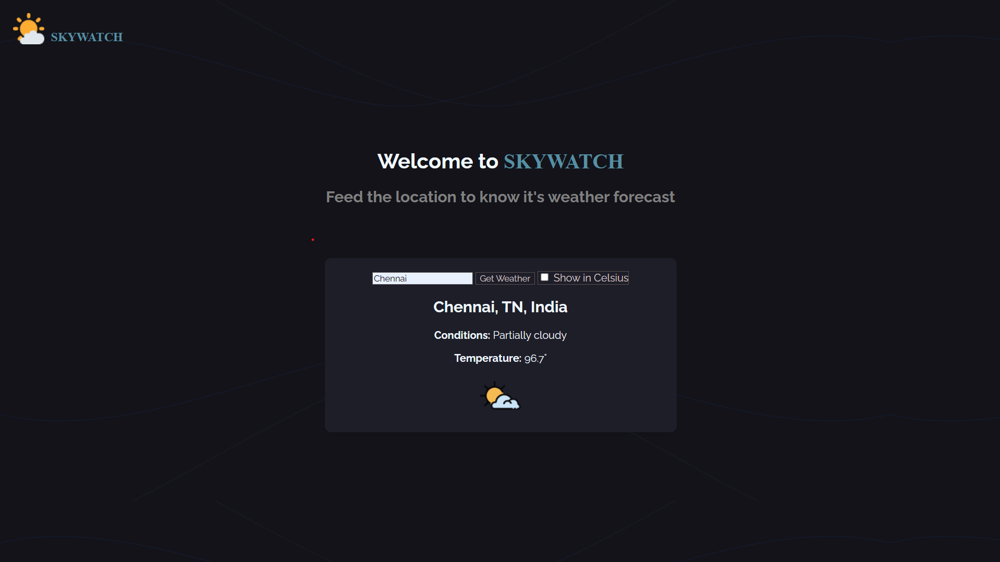

# 🌤️ Skywatch

> A clean and dynamic weather forecast web app that gives you real-time weather updates for any location on Earth. Built using the **Visual Crossing Weather API**, with support for both Celsius and Fahrenheit temperature display.

---

## 🚀 Live Demo

🌐 [Visit Skywatch →](https://skywatch-aryan.netlify.app)

---

## 🌈 Preview



---

## 📌 Features

- 🔍 Search weather by location (city, country)
- 🌡️ Toggle between Celsius and Fahrenheit
- 🏙️ Default weather shown for New Delhi
- ☀️ Dynamic UI with background and icons that match the weather
- ⚡ Built using vanilla JavaScript — no frameworks!

---

## 🧠 How It Works

- Fetches weather data from the **Visual Crossing API**
- Uses `async/await` to handle API calls
- Extracts and displays:
  - Location
  - Temperature
  - Weather condition
  - Relevant weather icon

---

## ⚙️ Setup & Getting Started

```bash
git clone https://github.com/singharyan006/skywatch.git
cd skywatch
```
Then open index.html directly in your browser
OR use a static server like Live Server in VS Code.

---

## 📁 Folder Structure
```
skywatch/
├── index.html
├── style.css
├── script.js
├── README.md
├── LICENSE
└── assets/
    ├── preview.png
    ├── favicon.ico
    └── background.jpg
```

---

## 🔑 API Key Setup
- To make the app work with live weather data:
    1. Go to Visual Crossing and create a free account
    2. Get your API key from the dashboard
    3. In your local project, open script.js
    4. Replace the placeholder API key with your own like this:
    
    ```
    const apiKey = "YOUR_API_KEY_HERE";
    ```

---

## 🧰 Tech Stack
- HTML5
- CSS3
- JavaScript (ES6+)
- Visual Crossing Weather API
- Netlify for deployment

---

## 📜 License
Licensed under the [MIT License](LICENSE).